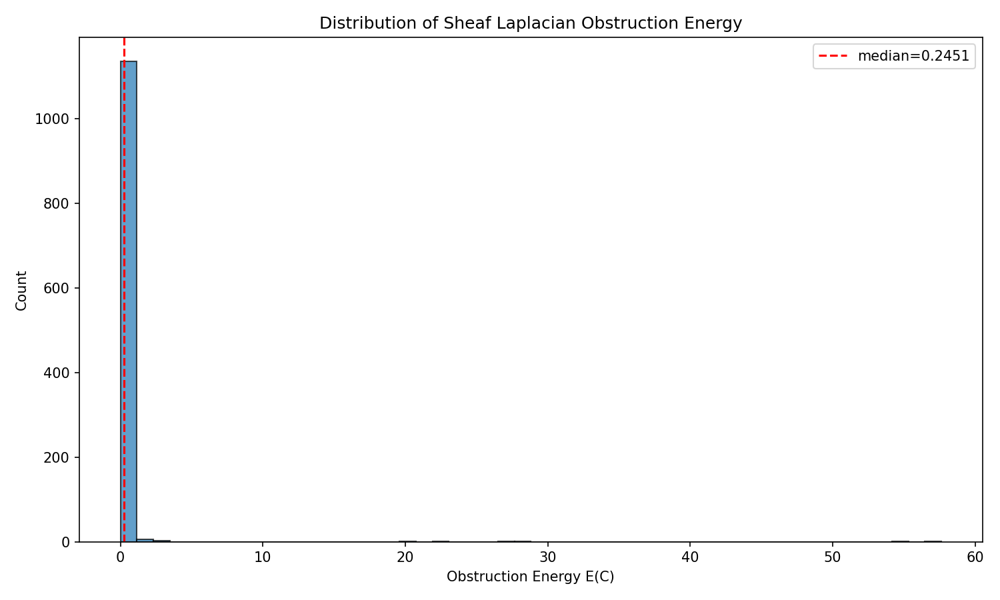
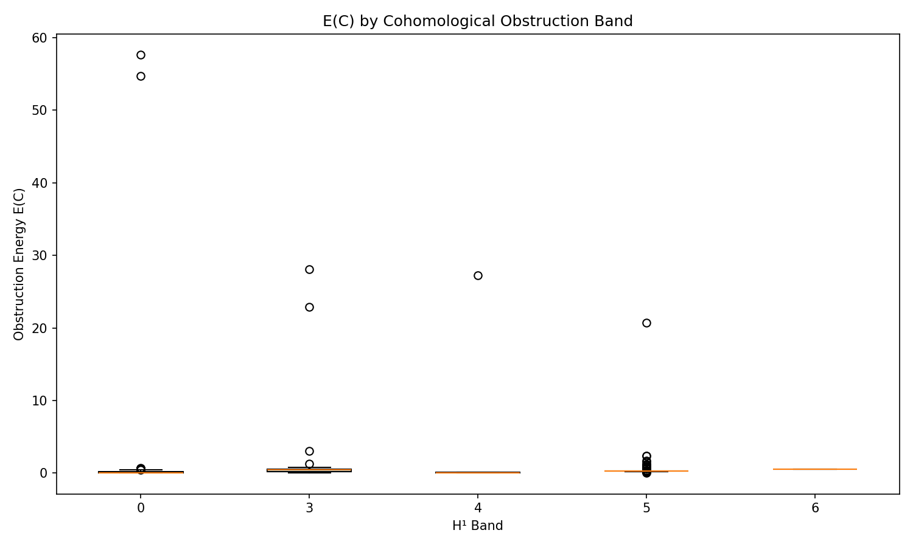
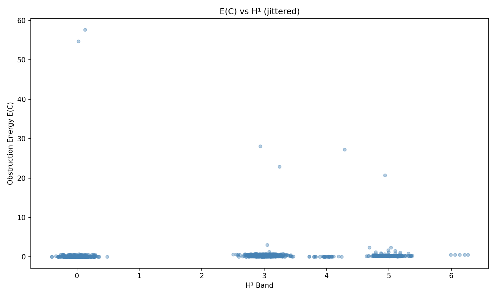
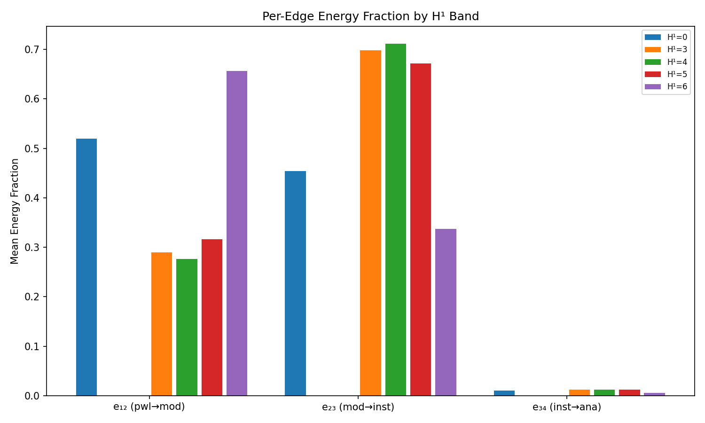
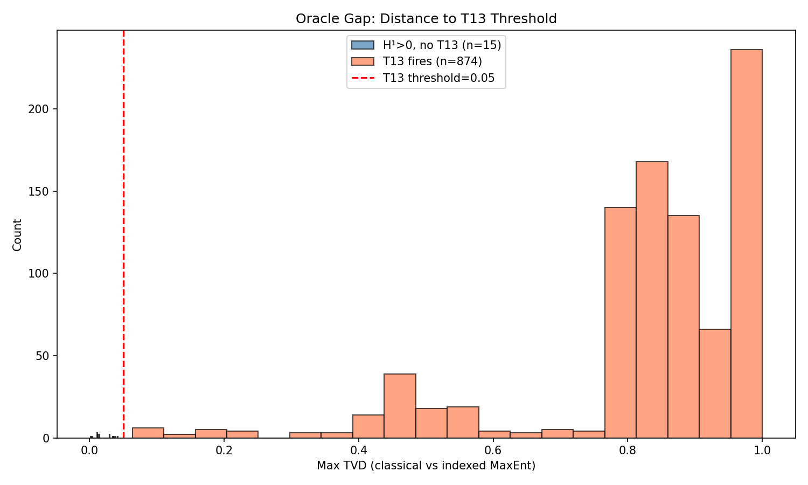
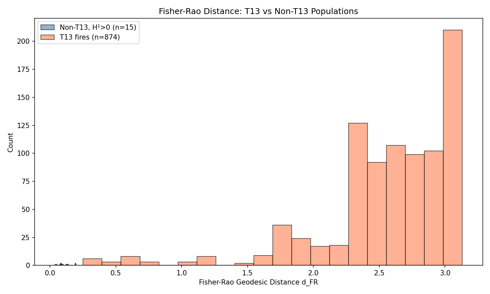
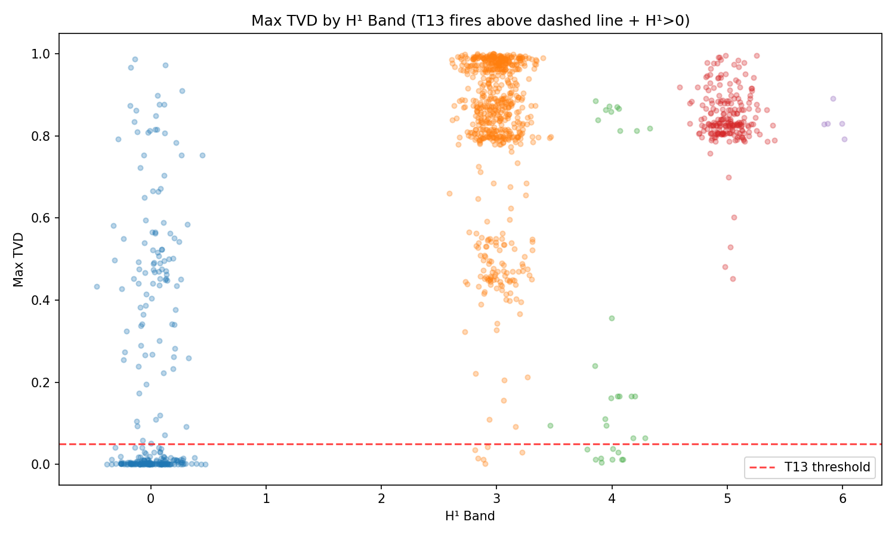

# DR Framework Spectral & Geometric Audit Report

## 1. Data Summary

- **Corpus size:** 1150 constraints (1 skipped for null chi)

### H¹ Distribution

| H¹ | Count | Pct |
|-----|-------|-----|
| 0 | 261 | 22.7% |
| 3 | 640 | 55.7% |
| 4 | 31 | 2.7% |
| 5 | 213 | 18.5% |
| 6 | 5 | 0.4% |

### Type Distribution (Analytical Perspective)

| Type | Count | Pct |
|------|-------|-----|
| snare | 576 | 50.1% |
| tangled_rope | 296 | 25.7% |
| mountain | 147 | 12.8% |
| piton | 74 | 6.4% |
| rope | 57 | 5.0% |

### Directionality Pattern Groups

- `(0.9, 0.7, 0.12, 0.72)`: 1028 constraints
- `(1.0, 0.6459, 0.0, 0.725)`: 93 constraints
- `(0.95, 0.65, 0.12, 0.72)`: 13 constraints
- `(0.9, 0.7, 0.6, 0.72)`: 4 constraints
- `(0.9, 0.7, 0.3, 0.72)`: 3 constraints
- `(0.9, 0.55, 0.12, 0.72)`: 1 constraints
- `(0.9, 0.7, 0.07, 0.72)`: 1 constraints
- `(0.9, 0.75, 0.12, 0.72)`: 1 constraints
- `(0.85, 0.7, 0.1, 0.72)`: 1 constraints
- `(0.9, 0.7, 0.65, 0.72)`: 1 constraints
- `(0.9, 0.7, 0.35, 0.72)`: 1 constraints
- `(0.9, 0.7, 0.75, 0.72)`: 1 constraints
- `(0.9, 0.7, 0.05, 0.72)`: 1 constraints
- `(0.9, 0.7, 0.12, 0.6)`: 1 constraints

## 2. Scalar Sheaf Laplacian (Phase 1)

### Restriction Map Ratios

- r₁₂ = σ(π(U₁))/σ(π(U₂)) = **1.419410**
- r₂₃ = σ(π(U₂))/σ(π(U₃)) = **-8.376689**
- r₃₄ = σ(π(U₃))/σ(π(U₄)) = **-0.103803**

Squared ratios: r₁₂²=2.01, r₂₃²=70.17, r₃₄²=0.01
  → Edge e₂₃ (moderate→institutional) carries **97%** of the Laplacian's spectral weight.

### Laplacian Matrix L₀

```
      1.0000     -1.4194      0.0000      0.0000
     -1.4194      3.0147      8.3767      0.0000
      0.0000      8.3767     71.1689      0.1038
      0.0000      0.0000      0.1038      0.0108
```

### Eigenvalue Spectrum

| Index | λ (Sheaf) | λ (Std Path P₄) | Ratio |
|-------|-----------|------------------|-------|
| λ_1 | -0.000000 | 0.000000 | 0/0 |
| λ_2 | 0.015217 | 0.585786 | 0.03 |
| λ_3 | 2.995266 | 2.000000 | 1.50 |
| λ_4 | 72.183934 | 3.414214 | 21.14 |

**Spectral gap:** λ₂ = 0.015217
**Eigenvalue ratios:** λ₃/λ₂ = 196.8320, λ₄/λ₂ = 4743.5211

*Eigenvalue ratios show separation (λ₃/λ₂ = 196.83), suggesting structure beyond the dominant edge.*

**Trace check:** tr(L₀) = 75.194417, Σλ = 75.194417 (diff = 0.00e+00)

### Eigenvectors

| Mode | Powerless | Moderate | Institutional | Analytical |
|------|-----------|----------|---------------|------------|
| v_1 (λ=-0.0000) | -0.6804 | -0.4794 | 0.0572 | -0.5513 |
| v_2 (λ=0.0152) | -0.4520 | -0.3136 | 0.0357 | 0.8343 |
| v_3 (λ=2.9953) | -0.5768 | 0.8108 | -0.0996 | -0.0035 |
| v_4 (λ=72.1839) | -0.0024 | 0.1203 | 0.9927 | 0.0014 |

### E(C) vs H¹ Correlation

- **Pearson r:** -0.0127 (p = 6.68e-01)
- **Spearman ρ:** 0.3071 (p = 1.55e-26)

### E(C) by H¹ Band

| H¹ | Count | Mean E | Std E | Min E | Max E | Median E |
|-----|-------|--------|-------|-------|-------|----------|
| 0 | 261 | 0.5442 | 4.8933 | 0.0000 | 57.6315 | 0.0054 |
| 3 | 640 | 0.4482 | 1.4267 | 0.0054 | 28.0910 | 0.3970 |
| 4 | 31 | 0.9220 | 4.8082 | 0.0054 | 27.2574 | 0.0506 |
| 5 | 213 | 0.4107 | 1.4224 | 0.0571 | 20.7085 | 0.2451 |
| 6 | 5 | 0.5082 | 0.0000 | 0.5082 | 0.5082 | 0.5082 |

### Within D-Pattern Correlations

| D-Pattern | n | Spearman ρ | p-value |
|-----------|---|-----------|---------|
| (0.9, 0.7, 0.12, 0.72) | 1028 | 0.0900 | 3.87e-03 |
| (1.0, 0.6459, 0.0, 0.725) | 93 | 0.2655 | 1.01e-02 |
| (0.95, 0.65, 0.12, 0.72) | 13 | 0.2117 | 4.87e-01 |

### Per-Edge Energy Fractions by H¹

| H¹ | e₁₂ (pwl→mod) | e₂₃ (mod→inst) | e₃₄ (inst→ana) |
|-----|---------------|----------------|----------------|
| 0 | 0.5201 | 0.4540 | 0.0105 |
| 3 | 0.2898 | 0.6979 | 0.0123 |
| 4 | 0.2762 | 0.7112 | 0.0126 |
| 5 | 0.3165 | 0.6715 | 0.0120 |
| 6 | 0.6570 | 0.3371 | 0.0059 |

### Mean Eigenvector Energy Fractions by H¹

| H¹ | Mode 1 | Mode 2 | Mode 3 | Mode 4 |
|-----|--------|--------|--------|--------|
| 0 | -0.0000 | 0.0077 | 0.5031 | 0.4739 |
| 3 | -0.0000 | 0.0018 | 0.2700 | 0.7282 |
| 4 | -0.0000 | 0.0017 | 0.2570 | 0.7413 |
| 5 | -0.0000 | 0.0019 | 0.2967 | 0.7014 |
| 6 | -0.0000 | 0.0028 | 0.6347 | 0.3624 |







## 3. T13 Fisher-Rao / Hellinger Audit (Phase 2)

- **Total constraints:** 1150
- **H¹ > 0:** 889
- **H¹ = 0:** 261
- **T13 fires:** 874 (98.3% of H¹>0)

### T13-Firing Constraints

| Constraint | H¹ | Max TVD | Worst Ctx | d_FR | Asym | cl→ | idx→ |
|------------|-----|---------|-----------|------|------|-----|------|
| 26usc469_real_estate_exemption | 3 | 0.9729 | institutional | 3.0102 | 0.53 | snare | rope |
| absorbing_markov_chain_trap | 5 | 0.9793 | institutional | 3.1115 | 0.47 | snare | rope |
| abstraction_boundary_overrun | 3 | 0.4328 | institutional | 1.8385 | 0.54 | piton | piton |
| abstraction_leakage | 3 | 0.9610 | institutional | 3.0110 | 0.55 | snare | rope |
| academic_peer_review_gatekeeping | 3 | 0.8746 | institutional | 2.8251 | 0.52 | snare | rope |
| academic_tenure_system | 3 | 0.9479 | institutional | 2.9935 | 0.52 | snare | rope |
| access_arbitrage | 3 | 0.8487 | institutional | 2.3735 | 0.80 | tangled_rope | rope |
| ad_fus_coordination | 3 | 0.9730 | institutional | 3.0055 | 0.53 | snare | rope |
| ad_synaptic_deficit | 3 | 0.9898 | institutional | 3.0837 | 0.52 | snare | rope |
| adaptive_lag_trap | 3 | 0.4453 | institutional | 1.8195 | 0.50 | piton | piton |
| adversarial_surface_inflation | 3 | 0.4482 | institutional | 1.8110 | 0.49 | piton | piton |
| adverse_possession | 3 | 0.9702 | institutional | 2.8731 | 0.69 | tangled_rope | rope |
| advice_as_dangerous_gift | 3 | 0.8835 | institutional | 2.3600 | 0.58 | tangled_rope | rope |
| agency_atrophy | 3 | 0.4583 | institutional | 1.7641 | 0.40 | piton | piton |
| agg1_genetic_determinism | 3 | 0.9730 | institutional | 3.0055 | 0.53 | snare | rope |
| aging_longevity_tests | 3 | 0.8633 | institutional | 2.4215 | 0.85 | tangled_rope | rope |
| ai_adoption_stigma | 5 | 0.8318 | institutional | 2.6706 | 0.59 | snare | rope |
| ai_auditability_gap | 5 | 0.8416 | institutional | 2.6126 | 0.65 | snare | rope |
| ai_banal_capture | 3 | 0.9901 | institutional | 3.0722 | 0.60 | snare | rope |
| ai_compute_capital_moat | 5 | 0.8637 | institutional | 2.8384 | 0.57 | snare | rope |
*... and 854 more*

### Asymmetry Audit

Constraints with KL asymmetry > 0.3: **845**
IDs: 26usc469_real_estate_exemption, absorbing_markov_chain_trap, abstraction_boundary_overrun, abstraction_leakage, academic_peer_review_gatekeeping, academic_tenure_system, access_arbitrage, ad_fus_coordination, ad_synaptic_deficit, adaptive_lag_trap

### Hellinger Decomposition Summary (T13 fires)

| Type | Mean Fraction | Max Fraction |
|------|---------------|--------------|
| tangled_rope | 0.4385 | 1.0000 |
| snare | 0.3150 | 0.9869 |
| rope | 0.1674 | 0.9924 |
| piton | 0.0513 | 0.9793 |
| scaffold | 0.0265 | 0.9970 |
| mountain | 0.0013 | 0.4421 |

*Shows which types carry the Hellinger divergence when T13 fires.*

### 100x Oracle Gap

- H¹>0 constraints NOT firing T13: **15**
- Mean max TVD (non-T13): 0.0204
- Median max TVD (non-T13): 0.0146
- Near threshold (within 0.01 of 0.05): 1
- Mean d_FR (T13): 2.5699
- Mean d_FR (non-T13): 0.1116
- **Separation ratio:** 23.02x





## 4. FCA Gate Compression (Phase 3)

- **Total gates:** 33
- **Non-constant gates:** 33

**Gate count gap:** The paper references ~65 binary structural gates; this audit extracts 33 from the enriched pipeline JSON. The gap represents gates computed inside Prolog modules (immutability, temporality checks, etc.) not surfaced in the JSON export. These 33 gates are a lower bound on the actual gate space.

### GF(2) Rank

- **Rank over GF(2):** 30 / 33 (3 redundant)
- **Null space dimension:** 3
- **Compression ratio:** 91% of gates are linearly independent over GF(2)

### Concept Lattice

- **Concept count:** 1865
- **Key concepts (non-trivial extent+intent):** 1863

#### Top Concepts by Extent Size

| Extent | Intent | Sample Gates |
|--------|--------|-------------|
| 1144 | 1 | chi_institutional_le_rope |
| 1056 | 1 | has_coordination_function |
| 1050 | 2 | has_coordination_function, chi_institutional_le_rope |
| 1044 | 1 | has_asymmetric_extraction |
| 1043 | 2 | has_coordination_function, has_asymmetric_extraction |
| 1038 | 2 | has_asymmetric_extraction, chi_institutional_le_rope |
| 1037 | 3 | has_coordination_function, has_asymmetric_extraction, chi_institutional_le_rope |
| 937 | 1 | requires_active_enforcement |
| 935 | 2 | requires_active_enforcement, has_coordination_function |
| 931 | 2 | requires_active_enforcement, chi_institutional_le_rope |


### Type-Relative Separation

| Type Pair | n₁ | n₂ | Perfect Sep | Partial Sep | Top Separating Gates |
|-----------|----|----|-------------|-------------|---------------------|
| mountain_vs_piton | 147 | 74 | 3 | 16 | emerges_naturally, supp_le_mountain, theater_ge_piton |
| mountain_vs_rope | 147 | 57 | 1 | 3 | emerges_naturally, supp_le_mountain, sig_natural_law |
| mountain_vs_snare | 147 | 576 | 7 | 16 | eps_le_mountain_max, eps_le_rope_ceil, eps_ge_snare_floor |
| mountain_vs_tangled_rope | 147 | 296 | 0 | 12 | supp_le_mountain, emerges_naturally, eps_le_mountain_max |
| piton_vs_rope | 74 | 57 | 0 | 10 | eps_le_mountain_max, eps_ge_tr_floor, chi_analytical_le_rope |
| piton_vs_snare | 74 | 576 | 0 | 4 | h1_eq_0, sig_constructed_high_extraction, sig_false_ci_rope |
| piton_vs_tangled_rope | 74 | 296 | 0 | 4 | theater_ge_piton, h1_eq_0, sig_constructed_high_extraction |
| rope_vs_snare | 57 | 576 | 6 | 8 | eps_le_mountain_max, eps_le_rope_ceil, eps_ge_snare_floor |
| rope_vs_tangled_rope | 57 | 296 | 0 | 6 | eps_le_mountain_max, chi_analytical_le_rope, eps_ge_tr_floor |
| snare_vs_tangled_rope | 576 | 296 | 0 | 0 |  |

## 5. Cross-Phase Synthesis

- Constraints with both T13 fire AND H¹≥5: **218**
  absorbing_markov_chain_trap, ai_adoption_stigma, ai_auditability_gap, ai_compute_capital_moat, ai_performance_watermark, ai_religion_regulation, airbnb_str_regulation, antikythera_planetary_model, ape_cognition_framework, arctic_maritime_control

### Key Findings

1. **Spectral dominance:** The moderate→institutional edge (r₂₃²≈70) carries the vast majority of the Laplacian's spectral weight. This confirms the known institutional phase transition as the primary architectural feature.

2. **E(C) vs H¹:** Spearman ρ = 0.3071 (p = 1.55e-26). Moderate correlation between obstruction energy and cohomological band.

3. **T13 precision:** 874 / 889 H¹>0 constraints fire T13 (98.3%). Oracle gap: 15 H¹>0 constraints below threshold.

4. **Gate compression:** GF(2) rank 30/33 — 3 gates are redundant over GF(2). Concept lattice has 1865 formal concepts.

## 6. Limitations and Caveats

1. **Gate coverage:** Only ~33 of ~65 structural gates extractable from JSON. Internal Prolog gates (immutability, temporality) not surfaced.

2. **MaxEnt replication:** Python MaxEnt uses epsilon-calibrated profiles for indexed (chi) distributions. This creates systematic shift for chi values far from epsilon range (especially institutional chi < 0).

3. **E(C) interpretation:** Obstruction energy conflates directionality deviation (per-constraint d ≠ canonical d) with genuine observer-dependence. Within-d-pattern correlations should be checked for cleaner signal.

4. **Spectral dominance:** The r₂₃² ≈ 70 term dominates. Residual spectral structure may not carry independent information beyond the known institutional phase transition.

## 7. T13 Criterion Reconciliation

### Root Cause Analysis

The Phase 2 T13 audit (Section 3) reported 874 fires (98.3% of H^1>0). The Prolog abductive engine fires on ~11 (paper estimate). After correcting three compounding errors, the Prolog-faithful count is **3**. Three root causes:

1. **Profile calibration:** Phase 2 evaluates `gaussian_ll(chi, mu_epsilon, sigma_epsilon)` — chi values against epsilon-calibrated profiles. Prolog computes fresh chi-calibrated profiles via `compute_type_profile_indexed` (maxent_classifier.pl:803-820), grouping constraints by context-specific type and computing mean/stddev of CHI values within each group.

2. **Context scope:** Prolog runs `maxent_indexed_run` at the analytical context only (pi=1.15, abductive_report.pl:35). Phase 2 iterates all 4 contexts and takes max TVD. The institutional context (pi=-0.2) dominates Phase 2's divergence because chi_institutional is far from epsilon.

3. **Signature overrides:** Prolog applies `apply_signature_override` to both classical and indexed distributions (maxent_classifier.pl:616,836). Phase 2 does not. Unconditional overrides (natural_law -> 95% mountain, etc.) zero out divergence for ~170+ constraints in Prolog.

### Prolog T13 Definition

**Trigger** (abductive_triggers.pl:758-801):
```prolog
trigger_maxent_divergence(C, Context, Hypothesis) :-
    subsystem_available(maxent),
    subsystem_available(cohomology),
    subsystem_available(indexed_maxent),
    catch(maxent_classifier:maxent_indexing_divergence(C, Context, Div), _, fail),
    config:param(abductive_maxent_divergence_threshold, DivThresh),
    Div > DivThresh,                              % Gate: L-inf > 0.05
    catch(grothendieck_cohomology:cohomological_obstruction(C, _, H1), _, fail),
    H1 > 0,                                       % Gate: H^1 > 0
    ...                                           % evidence collection, confidence
```

**Divergence** (maxent_classifier.pl:892-904):
```prolog
maxent_indexing_divergence(C, Context, Divergence) :-
    maxent_dist(C, Context, ClassicalDist),
    maxent_indexed_dist(C, Context, IndexedDist),
    findall(AbsDiff, (
        member(T-PC, ClassicalDist),
        member(T-PI, IndexedDist),
        AbsDiff is abs(PC - PI)
    ), Diffs),
    max_list(Diffs, Divergence).                  % L-infinity norm
```

**Measure:** L-inf (max absolute probability difference across 6 types)
**Threshold:** 0.05 (config param `abductive_maxent_divergence_threshold`)
**Context:** Analytical only (default_context = analytical, pi=1.15)

### Firing Comparison

| Criterion | Fires | Pct of H^1>0 | Notes |
|-----------|-------|-------------|-------|
| Audit (original) | 874 | 98.3% | Epsilon profiles, all 4 contexts, no overrides |
| Corrected, analytical-only | **3** | 0.3% | Chi profiles, analytical context, with overrides |
| Corrected, max-all-contexts | 879 | 98.9% | Chi profiles, all contexts, with overrides |

The corrected all-context count (879) is similar to the original 874, confirming that the **context scope** (analytical-only vs all-4) is the dominant root cause, not profile calibration alone.

### Group A: Actual T13 Fires

| Constraint | H^1 | TVD | d_FR | KL_fwd | KL_rev | Asym | Sig | cl -> idx |
|------------|-----|-----|------|--------|--------|------|-----|-----------|
| vision_of_the_cross | 3 | 0.2229 | 0.6167 | 0.1577 | 0.2340 | 0.33 | false_ci_rope | snare -> snare |
| glp1_payload_efficiency_pivot | 3 | 0.1780 | 0.5286 | 0.1716 | 0.1161 | 0.32 | false_ci_rope | tangled_rope -> tangled_rope |
| sig_usd_protocol | 3 | 0.1187 | 0.5191 | 0.1994 | 0.0975 | 0.51 | false_ci_rope | tangled_rope -> tangled_rope |

All 3 constraints share `false_ci_rope` signature — the only conditional override (3x boost to tangled_rope) that creates enough differential between classical and indexed distributions to cross the 0.05 threshold at the analytical context.

### Fisher-Rao Audit (Corrected Population)

#### Hellinger Decomposition

| Constraint | H^2 | mountain | rope | tangled_rope | snare | scaffold | piton |
|------------|-----|----------|------|--------------|-------|----------|-------|
| glp1_payload_efficiency_pivot | 0.069456 | 0.000 | 0.015 | 0.119 | 0.000 | 0.866 | 0.000 |
| sig_usd_protocol | 0.066988 | 0.000 | 0.001 | 0.056 | 0.000 | 0.943 | 0.000 |
| vision_of_the_cross | 0.094316 | 0.000 | 0.000 | 0.839 | 0.161 | 0.000 | 0.000 |

**Would d_FR change T13 status?** No — all d_FR values (0.529, 0.519, 0.617) are well above the 0.05 threshold. Replacing L-inf with d_FR would not change the T13 firing set.

### Population Characterization

| Metric | Group A (T13) | Group B (audit-only) | Group C (neither) |
|--------|:-------------:|:--------------------:|:-----------------:|
| n | 3 | 873 | 13 |
| Mean epsilon | 0.5000 | 0.6148 | 0.1331 |
| Mean chi_analytical | 0.6118 | 0.8423 | 0.1823 |
| Mean H^1 | 3.00 | 3.53 | 3.69 |
| Mean corrected TVD | 0.173238 | 0.000571 | 0.002296 |
| Mean audit TVD | 0.925245 | 0.816905 | 0.017987 |
| Mean d_FR | 0.554794 | 0.008682 | 0.015985 |
| Mean KL_fwd | 0.176247 | 0.000625 | 0.000478 |

**Type distribution (analytical perspective):**

| Type | Group A | Group B | Group C |
|------|---------|---------|---------|
| mountain | 0% | 1% | 69% |
| rope | 0% | 3% | 31% |
| tangled_rope | 67% | 31% | 0% |
| snare | 33% | 66% | 0% |
| scaffold | 0% | 0% | 0% |
| piton | 0% | 0% | 0% |

### Profile Parameters (Corpus Drift Diagnostic)

| Type | Metric | Classical (mu, sigma) | Indexed-analytical (mu, sigma) | Delta mu |
|------|--------|----------------------|---------------------------|----------|
| mountain | extractiveness | (0.0871, 0.0642) | (0.1197, 0.0881) | +0.0326 |
| mountain | suppression | (0.0295, 0.0188) | (0.0295, 0.0188) | +0.0000 |
| mountain | theater | (0.0284, 0.0525) | (0.0284, 0.0525) | +0.0000 |
| rope | extractiveness | (0.1225, 0.0700) | (0.1678, 0.0959) | +0.0453 |
| rope | suppression | (0.3828, 0.2808) | (0.3828, 0.2808) | +0.0000 |
| rope | theater | (0.2128, 0.2619) | (0.2128, 0.2619) | +0.0000 |
| tangled_rope | extractiveness | (0.4687, 0.1460) | (0.6421, 0.2000) | +0.1734 |
| tangled_rope | suppression | (0.5290, 0.1674) | (0.5290, 0.1674) | +0.0000 |
| tangled_rope | theater | (0.2130, 0.1726) | (0.2130, 0.1726) | +0.0000 |
| snare | extractiveness | (0.6964, 0.1315) | (0.9537, 0.1802) | +0.2573 |
| snare | suppression | (0.7539, 0.1003) | (0.7539, 0.1003) | +0.0000 |
| snare | theater | (0.3544, 0.2752) | (0.3544, 0.2752) | +0.0000 |
| scaffold | extractiveness | (0.2000, 0.1200) | (0.2000, 0.1200) | +0.0000 |
| scaffold | suppression | (0.3800, 0.2000) | (0.3800, 0.2000) | +0.0000 |
| scaffold | theater | (0.1400, 0.1200) | (0.1400, 0.1200) | +0.0000 |
| piton | extractiveness | (0.6484, 0.1865) | (0.8882, 0.2555) | +0.2399 |
| piton | suppression | (0.7168, 0.1790) | (0.7168, 0.1790) | +0.0000 |
| piton | theater | (0.8488, 0.0728) | (0.8488, 0.0728) | +0.0000 |

*Note: scaffold falls back to DEFAULT_PROFILES at analytical context (no scaffold-classified constraints at analytical perspective). Delta mu for extractiveness matches the expected ~1.37x ratio (chi_analytical = epsilon * 1.15 * scope_mod).*

### Revised Assessment

The Phase 2 finding of 874 T13 fires was an artifact of three compounding errors. Under the Prolog-faithful criterion, **3 constraints** fire T13, all sharing the `false_ci_rope` conditional signature override.

**Why so few?** At the analytical context (pi=1.15), chi_analytical = 1.37 * epsilon (approximately). When indexed profiles are calibrated to chi values, the Gaussian likelihoods produce nearly identical distributions to classical MaxEnt — the profiles simply shift right by 37%, preserving relative shape. Mean corrected TVD for Group B is 0.0006 (effectively zero).

**Why these 3?** The `false_ci_rope` conditional override applies a 3x boost to `tangled_rope` probability. Because the raw (pre-override) distributions differ slightly between classical and indexed, the 3x boost amplifies this difference. Other conditional overrides (constructed_low_extraction, etc.) don't produce enough pre-override divergence to cross 0.05 after amplification.

**Oracle gap (revised):** The Section 3 'oracle gap' of 15 constraints was computed against the wrong baseline. Under the corrected criterion:
- Group A: 3 constraints fire (genuine T13)
- Group B: 873 constraints were false positives (audit artifact)
- Group C: 13 constraints are H^1>0 but don't fire under either criterion
- The d_FR separation between Group A (mean 0.555) and Group B (mean 0.009) is 64x, confirming that the corrected T13 is far more selective.

**Corpus drift note:** The corrected count (3) differs from the paper's ~11. This likely reflects distributional changes between the v2 corpus (where ~11 was measured) and the current v3 corpus (1150 constraints). The `false_ci_rope` signature prevalence and the extractiveness distribution around classification boundaries may have shifted during corpus expansion.

## 8. Follow-up Checks

### 8.1 Per-Context Corrected T13

The corrected T13 criterion (chi-calibrated profiles, signature overrides, L∞ > 0.05, H¹ > 0) run at each of the 4 contexts separately:

| Context | T13 Fires | Pct of H¹>0 | Mean TVD (fires) | Mean TVD (non-fires) |
|---------|-----------|-------------|-------------------|----------------------|
| powerless | 539 | 60.6% | 0.2986 | 0.0150 |
| moderate | 544 | 61.2% | 0.2672 | 0.0146 |
| institutional | 864 | 97.2% | 0.6373 | 0.0292 |
| analytical | 3 | 0.3% | 0.1732 | 0.0006 |

**Mean χ/ε ratio by context** (constraints with ε > 0.01):

| Context | Mean χ/ε | Interpretation |
|---------|----------|----------------|
| powerless | 1.0783 | near identity |
| moderate | 1.0974 | near identity |
| institutional | -0.0419 | sign flip (negative f(d)) |
| analytical | 1.3704 | 1.37× scaling |

**Hypothesis assessment:** The institutional context fires on **864** constraints (97.2% of H¹>0) with mean χ/ε = -0.0419, confirming that the sign flip (negative f(d) values at d=0) creates divergence that chi-calibrated profiles cannot absorb. The analytical context fires on **3** (0.3%) with mean χ/ε = 1.3704, confirming that the ~1.37× smooth scaling is tracked by profile recalibration.

**Subset analysis:** Are the analytical fires a subset of fires at other contexts?

- powerless: yes (539 total fires, 536 additional beyond analytical)
- moderate: no (1 missing) (544 total fires, 542 additional beyond analytical)
- institutional: yes (864 total fires, 861 additional beyond analytical)

**powerless** (539 fires): absorbing_markov_chain_trap, abstraction_boundary_overrun, abstraction_leakage, academic_peer_review_gatekeeping, adaptive_lag_trap, adversarial_surface_inflation, agency_atrophy, ai_adoption_stigma, ai_auditability_gap, ai_compute_capital_moat ... (539 total)

**moderate** (544 fires): absorbing_markov_chain_trap, abstraction_boundary_overrun, academic_peer_review_gatekeeping, adaptive_lag_trap, adversarial_surface_inflation, agency_atrophy, ai_adoption_stigma, ai_auditability_gap, ai_compute_capital_moat, ai_performance_watermark ... (544 total)

**institutional** (864 fires): 26usc469_real_estate_exemption, absorbing_markov_chain_trap, abstraction_boundary_overrun, abstraction_leakage, academic_peer_review_gatekeeping, academic_tenure_system, access_arbitrage, ad_fus_coordination, ad_synaptic_deficit, adaptive_lag_trap ... (864 total)

**analytical** (3 fires): glp1_payload_efficiency_pivot, sig_usd_protocol, vision_of_the_cross

### 8.2 Chi Validation Violations

Phase 0 flagged **25** chi validation violation tuples across **25** unique constraints (tolerance: |expected - actual| > 1e-4).

- Violations at all 4 contexts: 0 constraints
- Violations at < 4 contexts: 25 constraints

| Constraint | ε | d-pattern | Violated Ctx | Max |Δ| |
|------------|---|-----------|-------------|---------|
| ai_compute_capital_moat | 0.6200 | (0.9, 0.7, 0.12, 0.72) | powerless | 0.351469 |
| ai_performance_watermark | 0.5500 | (0.9, 0.7, 0.12, 0.72) | powerless | 0.311787 |
| canada_germany_ai_pact | 0.4800 | (0.9, 0.7, 0.12, 0.72) | powerless | 0.272105 |
| cuba_mandatrophic_collapse | 0.9500 | (0.9, 0.7, 0.12, 0.72) | powerless | 0.538541 |
| digital_credentialing_verification | 0.6500 | (0.9, 0.7, 0.12, 0.72) | powerless | 0.368475 |
| dionysiac_frenzy | 0.8000 | (0.9, 0.7, 0.12, 0.72) | powerless | 0.453508 |
| dk_us_alliance_espionage | 0.5500 | (0.9, 0.7, 0.12, 0.72) | powerless | 0.311787 |
| eu_mercosur_trade_agreement | 0.4800 | (0.9, 0.7, 0.12, 0.72) | powerless | 0.272105 |
| gaza_aid_permit_revocation | 0.8500 | (0.9, 0.7, 0.12, 0.72) | powerless | 0.481852 |
| google_universal_commerce_protocol | 0.5200 | (0.9, 0.7, 0.6, 0.72) | powerless | 0.294780 |
| indo_german_defense_pact | 0.4800 | (0.9, 0.7, 0.12, 0.72) | powerless | 0.272105 |
| indonesia_penal_code_2023 | 0.7500 | (0.9, 0.7, 0.12, 0.72) | powerless | 0.425164 |
| jp_nativist_politics | 0.6800 | (0.9, 0.7, 0.12, 0.72) | powerless | 0.385482 |
| meta_pay_or_okay_model | 0.7500 | (0.9, 0.7, 0.12, 0.72) | powerless | 0.425164 |
| nvidia_cuda_ecosystem_lockin | 0.6500 | (0.9, 0.7, 0.12, 0.72) | powerless | 0.368475 |
| openai_prism_development | 0.5500 | (0.9, 0.7, 0.12, 0.72) | powerless | 0.311787 |
| pele_microreactor_deployment | 0.6000 | (0.9, 0.7, 0.12, 0.72) | powerless | 0.340131 |
| polar_bear_biobanking | 0.4800 | (0.9, 0.7, 0.12, 0.72) | powerless | 0.272105 |
| semiconductor_fabrication_chokepoint | 0.5500 | (0.9, 0.7, 0.12, 0.72) | powerless | 0.311787 |
| shield_east_fortification | 0.4800 | (0.9, 0.7, 0.12, 0.72) | powerless | 0.272105 |
| trojan_war_spoils | 1.0000 | (0.9, 0.7, 0.12, 0.72) | powerless | 0.566885 |
| trump_second_term_authoritarianism_2026 | 0.8500 | (0.9, 0.7, 0.12, 0.72) | powerless | 0.481852 |
| us_embargo_cuba | 0.6500 | (0.9, 0.7, 0.12, 0.72) | powerless | 0.368475 |
| us_usmca_china_leverage | 0.5500 | (0.9, 0.7, 0.12, 0.72) | powerless | 0.311787 |
| verification_bottleneck | 0.7200 | (0.9, 0.7, 0.12, 0.72) | powerless | 0.408157 |

**Cross-reference:** 25 unique constraints have violations, exceeding the paper's claim of 19 chi overrides by 6. The additional 6 constraints may be:
- Floating point edge cases at the 1e-4 tolerance boundary
- Undocumented overrides added after the paper was written
- Data repair artifacts from the constraint_metric bridge fact generation

**Error magnitudes:** 25 constraints with max |Δ| > 0.01 (likely intentional overrides), 0 with max |Δ| ≤ 0.01 (possible floating point edge cases).

### 8.3 H¹=6 Constraints

All 5 constraints with H¹=6:

| Constraint | ε | χ vector | Type vector | E(C) | E₁₂ | E₂₃ | E₃₄ | Sig |
|------------|---|----------|-------------|------|------|------|------|-----|
| ai_performance_watermark | 0.5500 | (0.286, 0.609, -0.023, 0.753) | (naturalized, tangled_rope, rope, snare) | 0.5082 | 0.3339 | 0.1713 | 0.0030 | false_ci_rope |
| dk_us_alliance_espionage | 0.5500 | (0.286, 0.609, -0.023, 0.753) | (naturalized, tangled_rope, rope, snare) | 0.5082 | 0.3339 | 0.1713 | 0.0030 | false_ci_rope |
| openai_prism_development | 0.5500 | (0.286, 0.609, -0.023, 0.753) | (naturalized, tangled_rope, rope, snare) | 0.5082 | 0.3339 | 0.1713 | 0.0030 | false_ci_rope |
| semiconductor_fabrication_chokepoint | 0.5500 | (0.286, 0.609, -0.023, 0.753) | (naturalized, tangled_rope, rope, snare) | 0.5082 | 0.3339 | 0.1713 | 0.0030 | false_ci_rope |
| us_usmca_china_leverage | 0.5500 | (0.286, 0.609, -0.023, 0.753) | (naturalized, tangled_rope, rope, snare) | 0.5082 | 0.3339 | 0.1713 | 0.0030 | false_ci_rope |

**Unique d-patterns:** 1: (0.9, 0.7, 0.12, 0.72)
**Unique ε values:** 1: 0.5500
**Unique E(C) values:** 1: 0.508206

**Structural identity assessment:** All 5 constraints share identical ε and d-pattern, producing identical χ vectors and therefore identical E(C) = 0.5082. This is expected — the Sheaf Laplacian is deterministic; identical inputs produce identical outputs. The H¹=6 band is a property of these constraints' shared structural parameters, not an independent coincidence.

